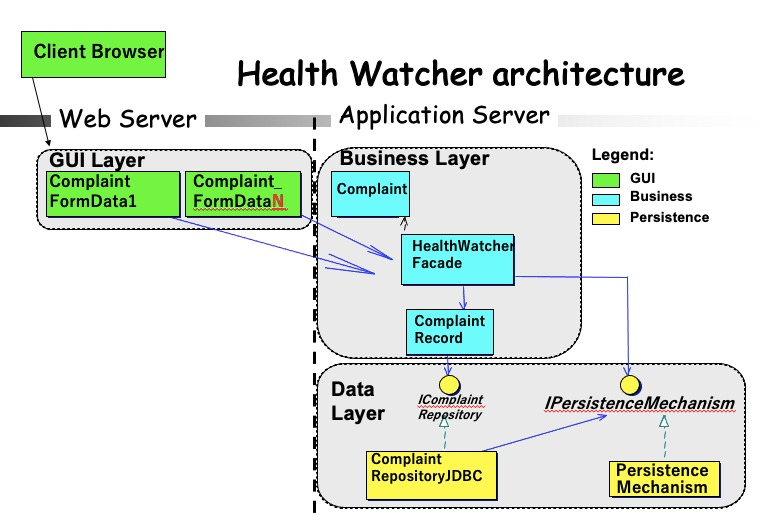

# Sistema de Registros de Reclamações de Saúde

Considere um sistema de informação de utilidade pública para registro de reclamações, baseadas na classe Complaint, sobre problemas relacionados à saúde dos cidadãos residentes em Recife. As reclamações são registradas, atualizadas e consultadas por meio de um cliente web.

As reclamações podem ser de natureza variada, onde cada tipo de reclamação tem uma série de informações associadas. Para esta atividade, considere os seguintes tipos: 

- `AnimalComplaint`: doenças relacionadas a animais, por exemplo, mosquitos ([formulário de exemplo](AnimalComplaint.html));
- `FoodComplaint`: casos de suspeita de ingestão de comida contaminada ([formulário de exemplo](FoodComplaint.html));
- `OtherComplaint`: outras causas que não as citadas pelos outros dois tipos de `Complaint`, ex: vazamento de esgoto ([formulário de exemplo](OtherComplaint.html)). 

Se baseie nos formulários HTML do sistema disponibilizados acima, e certifique-se de implementar a hierarquia da classe Complaint adequadamente. Notadamente Complaint é o tipo mais geral e abstrato onde podemos a partir dele instanciar os três tipos listados acima.

O principal ator do sistema é um residente da cidade de Recife (`Citizen`), que pode ser qualquer pessoa residente na cidade de Recife que deseja interagir com o sistema.

A imagem abaixo descreve a arquitetura simplificada do sistema. O sistema é estruturado com o objetivo de desacoplar suas diferentes partes para facilitar a mudança de forma independente. Portanto, a parte da interface com o usuário do sistema é desacoplada da parte que implementa a lógica de negócios que, por sua vez, também é desacoplada do gerenciamento do banco de dados.

Um dos requisitos do sistema é permitir que vários clientes acessem o sistema ao mesmo tempo. Portanto, uma abordagem cliente-servidor é utilizada para distribuir parte da execução, que é implementada pela classe `HealthWatcherFacade`. Interfaces, como `IComplaintRepository`, desacoplam a lógica de negócios do tipo específico de gerenciamento de dados em uso.

Usando as tecnologias de sua preferência (Java ou PHP, banco de dados ou framework de preferência), forneça uma implementação de pelo menos 2 dos casos de uso abaixo, onde **pelo menos um deles seja o Caso de Uso 1**: 

- Caso de Uso 1: Registrar Reclamação [*Complaint Registration*]
- Caso de Uso 2: Consultar Reclamação [*Search Complaint*]
- Caso de Uso 3: Atualizar Reclamação [*Update Complaint*]
- Caso de Uso 4: Remover Reclamação [*Delete Complaint*]

Com a definição bem formada da hierarquia de `Complaint`, os métodos referentes aos casos de uso podem se valer do reuso por polimorfismo; por exemplo, ao invés de criar um método de inserção para cada tipo de `Complaint`, é possível ter apenas um com o tipo mais geral, que é `Complaint`.